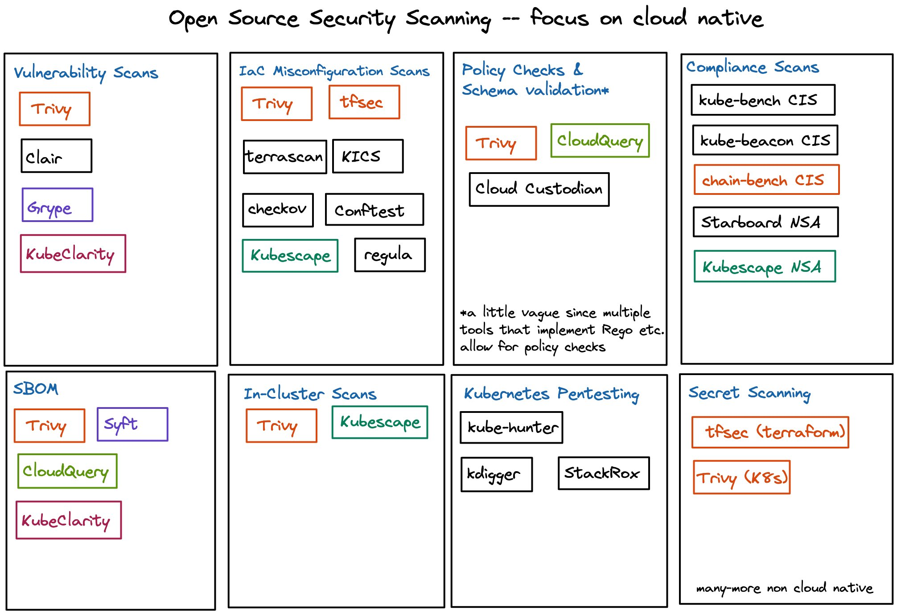

# Getting started with cloud native security

## Prerequisites

In order to get started with cloud native security, we assume that you have experience with the following technologies:
- Containers and containerisation tools such as Docker
- Basic understanding of Linux 
- Knowledge about Kubernetes 

Ideally, you want to get started with cloud native security when you get started with Kubernetes and other cloud native tools. 
However, you can really get started at any point.

Security tools can be integrated by anyone into their existing workflow.

## Cloud Native Security Scanners

The following graphic provides an overview of cloud native, open source security scanning tools:

## Use Cases and Scenarios

**Use Cases**

Several use cases and tutorials for the integrations of security tools are detailed in the GitHub repositories of this organisation. Below is a list of the different use cases across our repositories:
1. [Using Trivy to scan various resources through the CLI and in-cluster](https://github.com/Cloud-Native-Security/trivy-demo)
2. [Using the Trivy Operator for in-cluster security scans in combination with observability tools inlc. Prometheus and Grafana](https://github.com/Cloud-Native-Security/monitor-security)

Additionally, this repository provides several [scenarios.](./scenarios/scenario-one.md).

**Scenarios**

Scenarios provide a high-level example on how to use a specific tool for a particular purpose. 

While use cases showcase how to integrate tools in specific environments and with other tools, scenarios showcase only how to accomplish specific tasks with one tool.

List of Scenarios:
- [Scenario-One: How to get started with Trivy](./scenarios/scenario-one.md)